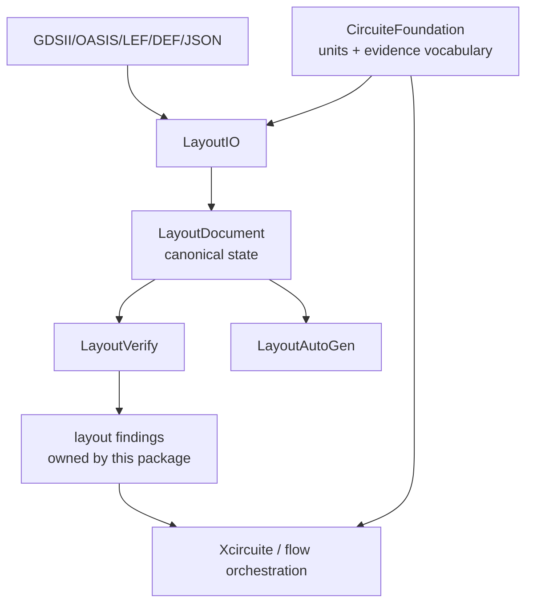

# semiconductor-layout design

## Purpose

This package is the physical-design library beneath a schematic/layout
application or a headless design agent. It models physical state and executes
layout algorithms. It does not own project manifests, run scheduling, approval
policy, or the cross-engine workflow.

## Layer responsibilities

| Layer | Owns | Does not own |
|---|---|---|
| `LayoutCore` | Canonical layout document and geometry | Artifact persistence and process execution |
| `LayoutTech` | Process layers, vias, rules, and qualification metadata | Foundry rule interpretation outside its schema |
| `LayoutVerify` | DRC/connectivity/extraction calculations and typed findings | UI presentation or release policy |
| `LayoutIO` | Serialization and standard-format conversion | Canonical project directory layout |
| `LayoutLVSExtraction` | Layout extraction deck/IR preparation and audit | Netlist comparison policy owned by verification consumers |
| `LayoutAutoGen` | Placement/routing/generation algorithms | Tool trust or human approval |
| `LayoutEditor` | Interactive command application and live feedback | Persistence workflow |
| `LayoutCommands` | Replayable command and artifact-producing CLI services | Long-running orchestration |

## Shared foundation contract

`CircuiteFoundation` is a dependency floor, not an adapter layer:

1. `DatabaseUnitScale` is the validated cross-package unit boundary.
2. `Engine` is available to domain engines that expose request/output
   execution; this package does not wrap every service in a universal envelope.
3. Artifact and diagnostic types are used at package boundaries when an
   artifact or finding crosses into an orchestration package.
4. Layout-specific types remain strongly typed and are not replaced by generic
   Foundation values.

## Determinism and signoff boundary

Imported identities are derived from stable source identity and element order.
Verification traverses reachable hierarchy with cycle/missing-reference checks.
`LayoutDRCService` distinguishes development geometry from exact-only
verification; exact-only mode must fail closed when its kernel cannot represent
the source geometry.

## Extension point for implementation agents

Agents extending this package should add domain types in the owning target,
preserve `LayoutDocument` as the canonical state, expose typed errors and
structured diagnostics, and add a focused Swift Testing suite. A new engine
should depend on `CircuiteFoundation` directly when it implements the shared
`Engine` protocol; it should not add a package-level adapter or project model.
