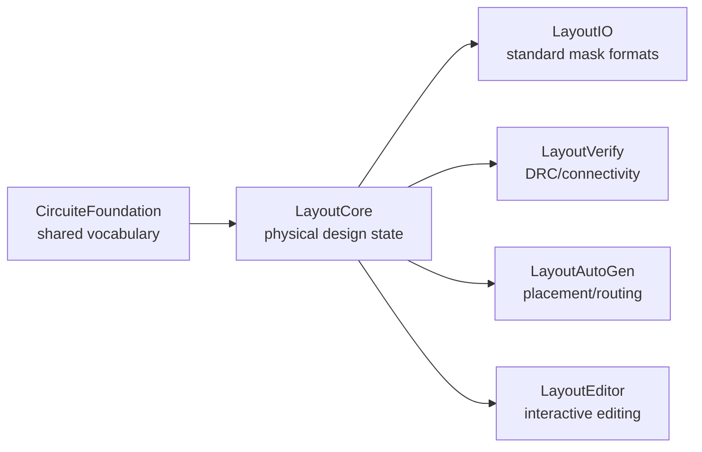

# semiconductor-layout

`semiconductor-layout` owns physical-design state and algorithms. It provides
the layout IR used by an editor, DRC/LVS preparation, automatic placement and
routing, and format conversion. It is independently usable and does not own a
project lifecycle or an Agent orchestration layer.

## Xcircuite integration

[`Xcircuite`](https://github.com/1amageek/Xcircuite) is the umbrella runtime
that connects this package to project lifecycle, layout stage execution,
DRC/LVS/PEX hand-off, and Agent/Human review. `semiconductor-layout` remains
independently usable and owns canonical layout state, physical-design
algorithms, and layout-level diagnostics.

## Boundary with CircuiteFoundation



`LayoutCore.LayoutUnits` is the layout-specific representation of database
units. It can be created from and validated through
`CircuiteFoundation.DatabaseUnitScale`. The non-throwing initializer remains
for Codable and format compatibility; new I/O and signoff boundaries should
use `validatedScale` before converting coordinates.

`CircuiteFoundation` supplies shared artifact, evidence, diagnostic, and
engine vocabulary. Layout geometry, technology rules, DRC violations, and
repair algorithms remain owned here.

## Products

| Product | Responsibility |
|---|---|
| `LayoutCore` | Cells, instances, shapes, vias, nets, constraints, transforms, and database units |
| `LayoutTech` | Layer and process-rule database plus qualified rule-program metadata |
| `LayoutVerify` | DRC, connectivity extraction, device extraction, netlist comparison, and verified repair deltas |
| `LayoutIO` | Layout document serialization and GDSII/OASIS/CIF/DXF/LEF/DEF conversion |
| `LayoutLVSExtraction` | Layout-to-netlist extraction deck preparation and audit contracts |
| `LayoutEditor` | Interactive editing, incremental DRC, connectivity, and design-intent commands |
| `LayoutAutoGen` | Cell generation, placement, routing, and DRC-driven repair loops |
| `LayoutCommands` | Replayable headless edit and conversion commands for agents and CI |
| `LayoutIntegration` | Host application and external signoff integration |
| `layout-command` | CLI for canonical layout edits, conversion, inspection, and connectivity diagnosis |

## Invariants

- Canonical layout state is `LayoutDocument`; UI state is not a source of
  truth.
- Imported cell, shape, and instance identities are deterministic for the same
  source library and element order.
- Hierarchy cycles and missing child cells are blocking verification diagnostics.
- Interactive DRC may use development geometry, while exact-only verification
  rejects unsupported path and non-rectilinear geometry with typed diagnostics.
- Seeded placement and routing operate on canonical ordering for reproducible
  results.
- Standard mask formats and structured JSON artifacts are the interchange
  boundary; project and run orchestration belongs to higher-level packages.

## Build and test

```bash
swift build
swift test
```

The package requires Swift 6.3 or later and macOS 26 or later. The package has
local development dependencies on `CircuiteFoundation`, `swift-mask-data`, and
`SignoffToolSupport`; downstream users should provide those package products
through Swift Package Manager.

See `DESIGN.md`, `REQUIREMENTS.md`, and `GOAL_STATUS.md` for the implementation
contract and the hand-off boundary for domain-specific agents.
