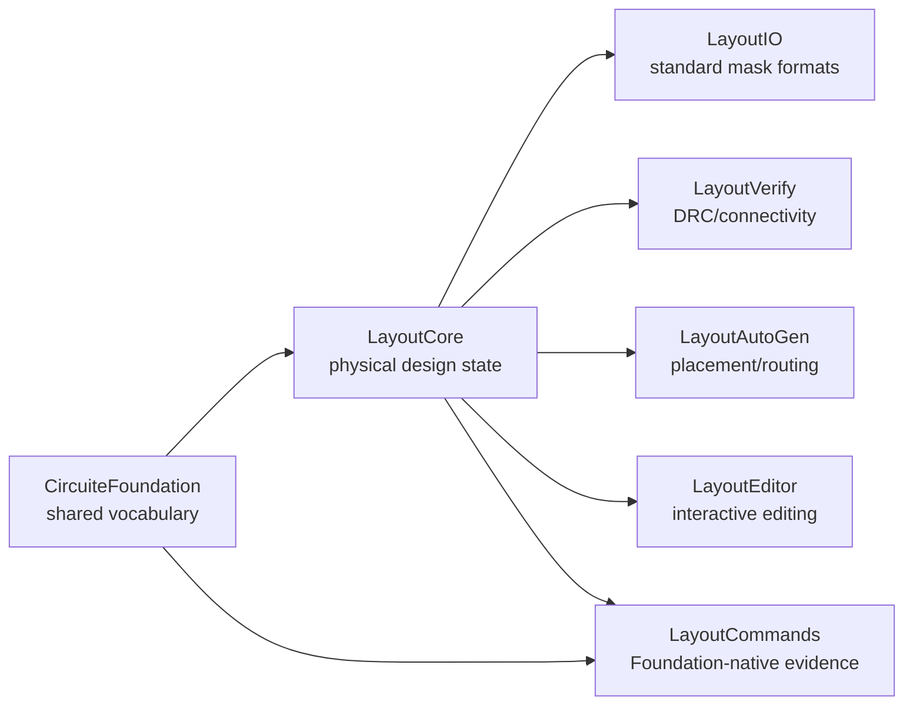

# semiconductor-layout

`semiconductor-layout` owns physical-design state and algorithms. It provides
the layout IR used by an editor, DRC/LVS preparation, automatic placement and
routing, and format conversion. It is independently usable and does not own a
project lifecycle or an Agent orchestration layer.

## Xcircuite integration

[`Xcircuite`](https://github.com/1amageek/Xcircuite) is the umbrella runtime
that connects this package to project lifecycle, layout stage execution,
DRC/LVS/PEX hand-off, and Agent/Human review. `semiconductor-layout` remains
independently usable and owns canonical layout state, physical-design
algorithms, and layout-level diagnostics.

## Boundary with CircuiteFoundation



`LayoutCore.LayoutUnits` owns a validated
`CircuiteFoundation.DatabaseUnitScale`. Construction and decoding reject
non-finite or non-positive scales, so every layout and technology boundary can
convert coordinates without carrying an invalid unit state.

`CircuiteFoundation` supplies shared artifact, evidence, diagnostic, and
engine vocabulary. Layout geometry, technology rules, DRC violations, and
repair algorithms remain owned here.

`LayoutCommands` emits `ArtifactReference` values and persists
`EvidenceManifest` directly. Artifact locations, roles, kinds, formats,
SHA-256 digests, and byte counts have a single source of truth in
`CircuiteFoundation`; command result JSON does not duplicate those fields.
Artifact creation is injected through `ArtifactReferencing` and defaults to
`LocalArtifactReferencer`.

## Products

| Product | Responsibility |
|---|---|
| `LayoutCore` | Cells, instances, shapes, vias, nets, constraints, transforms, and database units |
| `LayoutTech` | Layer and process-rule database plus qualified rule-program metadata |
| `LayoutVerify` | DRC, connectivity extraction, device extraction, netlist comparison, and verified repair deltas |
| `LayoutIO` | Layout document serialization and GDSII/OASIS/CIF/DXF/LEF/DEF conversion |
| `LayoutLVSExtraction` | Layout-to-netlist extraction deck preparation and audit contracts |
| `LayoutEditor` | Interactive editing, incremental DRC, connectivity, and design-intent commands |
| `LayoutAutoGen` | Cell generation, placement, routing, and DRC-driven repair loops |
| `LayoutCommands` | Replayable headless edit and conversion commands for agents and CI |
| `LayoutIntegration` | Host application and external signoff integration |
| `layout-command` | CLI for canonical layout edits, conversion, inspection, and connectivity diagnosis |

`LayoutLVSExtraction` treats process knowledge as data. A PDK supplies a
versioned `LayoutExtractionProcessProfile` JSON artifact and the corresponding
source deck. `LayoutExtractionProcessProfileLoader` validates profile structure,
identity, and the deck SHA-256 digest before exposing extraction rules. The
library contains no process-specific production profile factory.

The `LayoutEditor` NAND Flash preview loads its GDSII artifact and technology
sidecar from packaged resources through `LayoutPreviewResourceLoader`.
Missing or invalid resources produce `LayoutPreviewResourceError`; the preview
surfaces that error instead of searching developer-specific paths or silently
substituting unrelated geometry.

## Invariants

- Canonical layout state is `LayoutDocument`; UI state is not a source of
  truth.
- Imported cell, shape, and instance identities are deterministic for the same
  source library and element order.
- Hierarchy cycles and missing child cells are blocking verification diagnostics.
- Interactive DRC may use development geometry, while exact-only verification
  rejects unsupported path and non-rectilinear geometry with typed diagnostics.
- Seeded placement and routing operate on canonical ordering for reproducible
  results.
- Standard mask formats and structured JSON artifacts are the interchange
  boundary; project and run orchestration belongs to higher-level packages.
- Every `layout-command` evidence manifest uses Foundation schema v2,
  execution provenance, and Foundation artifact references.

## Build and test

```bash
xcodebuild \
  -scheme SemiconductorLayout-Package \
  -destination 'platform=macOS' \
  -test-timeouts-enabled YES \
  -maximum-test-execution-time-allowance 30 \
  test
```

For a bounded verification run, invoke the eight test targets separately with
`-only-testing:<target>` and a 120-second process deadline per invocation:
`LayoutIOTests`, `LayoutLVSExtractionTests`, `LayoutCoreTests`,
`LayoutIntegrationTests`, `LayoutAutoGenTests`, `LayoutEditorTests`,
`LayoutEngineTests`, and `LayoutCommandsTests`. `LayoutEditorFocused` is the
shared scheme for the small editor API/resource shard. This keeps compilation and runner shutdown attributable
to a single target while preserving the package-wide test surface.

The package requires Swift 6.3 or later and macOS 26 or later. The package has
local development dependencies on `CircuiteFoundation`, `swift-mask-data`, and
`SignoffToolSupport`; downstream users should provide those package products
through Swift Package Manager.

See `DESIGN.md`, `REQUIREMENTS.md`, and `GOAL_STATUS.md` for the implementation
contract and the hand-off boundary for domain-specific agents.
